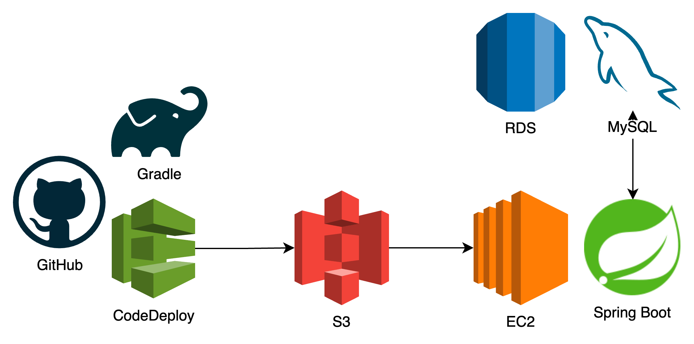
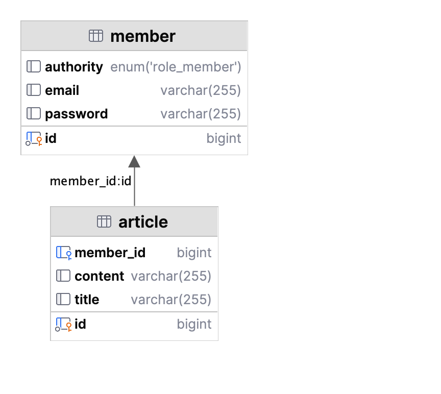

# springboot-board

스프링부트로 만드는 게시판

## 개발 환경

- Java 17
- Spring Boot 3.1.0
- Gradle 7.6

## 라이브러리 및 프레임워크

- Spring Data JPA
- Spring Security
- Spring Doc Open API
- H2
- Junit5

## DevOps 클라우드 및 CI/CD 환경

[API 명세 링크](http://13.125.76.194:8080/swagger-ui/index.html#/)



- GitHub Actions(Gradle, AWS CodeDeploy)
- AWS S3 Bucket
- AWS EC2(Ubuntu 22.04)
- AWS RDS(MySQL 8.0)

## ERD



## 애플리케이션 실행 방법

### 빌드 및 실행

```shell
$ ./gradlew build bootRun
```

### 테스트

```shell
$ ./gradlew test
```

## 구현 방법

### JWT 구현

`TokenResponse`는 로그인을 한 사용자에게 인증 토큰 값입니다.

`jwt`패키지는 jwt 토큰을 생성하고 검증하는 로직을 담고 있습니다.

`TokenProvider`는 위의 `TokenResponse`를 생성하는 역할을 합니다.

- 생성자에서 BASE64로 인코딩된 secret 값을 디코딩하여 `SecretKey`를 생성합니다.
- `generateTokenDto`는 토큰의 subject와 authorities(권한 정보)를 받아서 토큰을 생성합니다.
- `getAuthentication`는 JWT 토큰에서 인증 정보를 가져옵니다. 토큰을 파싱하여 `Claims`를 생성하고, 이를 바탕으로 `Authentication` 객체를 생성합니다.
- `validateToken`은 토큰의 유효성을 검증합니다. 토큰의 서명과 만료일을 검증하여 유효한 토큰인지 확인합니다.
- `parseClaims`는 JWT 토큰에서 `Claims`를 추출하고, 만료시엔 `ExpiredJwtException`을 발생시킵니다.

### Spring Security 구현

`JWT`를 통한 인증을 이용하므로, 이를 처리할 `JwtAuthenticationFilter`를 구현합니다. 편의상 JwtFilter라고 명명했습니다.

`JwtFilter`는 서블릿 필터로서, `OncePerRequestFilter`를 상속받아서 구현합니다. 이는 HTTP 요청이 들어올 때마다 필터가 실행되는 것을 보장합니다.

이 필터에서는, HTTP 요청의 "Authorization" 헤더에서 JWT 토큰을 추출하고, 이를 `TokenProvider`를 통해 검증합니다. 검증이 완료되면, `SecurityContextHolder`에 인증
정보를 저장합니다.

### Global Exception Handler 구현

`exception` 패키지는 전역 예외 처리를 담당합니다.

`GlobalExceptionHandler`는 `@ControllerAdvice` 어노테이션을 통해 전역 예외 처리를 담당합니다.

이 핸들러에서는 두 가지 예외 처리 메서드를 포함합니다.

- `handleApiException`
- `handleMethodArgumentNotValid`

`handleMethodArgumentNotValid`는 `ResponseEntityExceptionHandler`에서 오버라이딩 된 메서드입니다.

요구 사항에 사용자의 입력값 유효성 검사가 포함되어 있습니다. 이를 위해서 `@Valid` 어노테이션을 통하여 요청에 대한 인자 값을 검증합니다.

> 트러블 슈팅
>
> ResponseEntityExceptionHandler를 오버라이딩하지 않고 구현하게 되면 `MethodArgumentNotValidException` 예외를 두개의 핸들러에서 처리된다는 에러를 발생시킵니다.

### 문서화

`specification` 패키지는 API 명세를 담당합니다. interface를 통해 swagger 문서를 생성하게 됩니다.

### 테스트

- `ApiTest`클래스는 컨트롤러 통합 테스트를 담당합니다. `@SpringBootTest` 어노테이션을 통해 스프링 컨텍스트를 로드하고, 테스트 독립성을 위하여 매 테스트 전에 setUp 메서드가 DB를
  초기화하고, RestAssured의 포트를 설정합니다.
- `DatabaseCleanup`클래스는 테스트 독립성을 위하여 매 테스트 전에 DB를 초기화합니다. POJO로 작성되어 구현체들에 의존성을 갖지 않습니다.
- `RequestData`클래스는 컨트롤러 테스트에 필요한 요청에 대한 데이터를 담고 있습니다. 여러 종류의 요청에 대한 데이터를 캡슐화하여 테스트 코드의 중복을 줄입니다. header(access-token
  포함), body, query parameter를 쉽게 설정할 수 있습니다.
- `RestAssuredController`클래스는 RestAssured 라이브러리를 통하여 실제 요청을 보내게 됩니다. RestAssured의 요청을 더 쉽게 작성할 수 있도록 구현했습니다.
- `Steps`클래스들은 서비스와 관련된 요청을 처리합니다. 요청/응답 처리를 이 클래스에 위임하여 테스트 코드의 가독성을 높입니다.
- `ServiceTest`와 `ControllerTest`는 서비스 계층과 컨트롤러 계층의 통합 테스트를 담당합니다. 컨트롤러 테스트에서는 요청 값에 대한 검증을, 서비스 테스트에서는 도메인 로직에 대한 검증을
  수행합니다.
